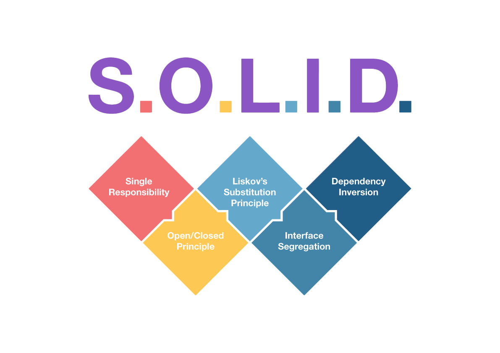

# SOLID Principles in .NET 6

## **Just a simple project using a payment process to demonstrate que five SOLID principles.**



SOLID is a set of five principles for object-oriented design, intended to make it easier to develop software that is easy to maintain and expand over time. The principles are:

**Single Responsibility Principle (SRP):** A class should have only one reason to change. This means that a class should have a single, well-defined responsibility and should not be responsible for multiple things. For example, consider a Customer class in a banking application. The Customer class should be responsible for storing information about the customer, such as their name and address, but it should not be responsible for performing calculations or making decisions about the customer's account.

**Open-Closed Principle (OCP):** Software entities (classes, modules, functions, etc.) should be open for extension but closed for modification. This means that you should be able to add new functionality to a class without changing its existing code. For example, you might want to add a new method to a Customer class to calculate the customer's credit score. You can do this by creating a new class that implements the calculation, and then using inheritance or composition to incorporate the new class into the Customer class.

**Liskov Substitution Principle (LSP):** Subtypes must be substitutable for their base types. This means that if a class is derived from another class, it should be able to be used in the same way as the base class without causing any issues. For example, if you have a base class called Shape and derived classes called Circle and Rectangle, the Circle and Rectangle classes should be able to be used interchangeably with the Shape class.

**Interface Segregation Principle (ISP):** Clients should not be forced to depend on interfaces they do not use. This means that if you have a class with a lot of methods, it's better to break it up into smaller, more specific interfaces that clients can choose to implement only the methods they need. For example, instead of having a single PaymentProcessor interface with methods for processing credit card payments, PayPal payments, and bank transfers, it might be better to have separate interfaces for each type of payment.

**Dependency Inversion Principle (DIP):** High-level modules should not depend on low-level modules. Both should depend on abstractions. This means that you should depend on abstractions, rather than concrete implementations, when designing your software. For example, instead of depending directly on a specific database implementation, you might create an abstract Database interface and then have concrete implementations of that interface for different databases.

Example code in C#:
```csharp
public interface IShape
{
    double Area();
}

public class Rectangle : IShape
{
    public double Width { get; set; }
    public double Height { get; set; }

    public double Area()
    {
        return Width * Height;
    }
}

public class Circle : IShape
{
    public double Radius { get; set; }

    public double Area()
    {
        return Math.PI * Radius * Radius;
    }
}

public class ShapeCalculator
{
    public double CalculateTotalArea(List<IShape> shapes)
    {
        double totalArea = 0;
        foreach (var shape in shapes)
        {
            totalArea += shape.Area();
        }
        return totalArea;
    }
}
```


*Extracted from ChatOpenAI*
